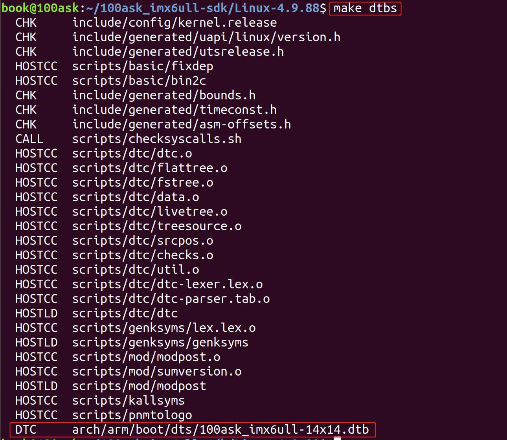
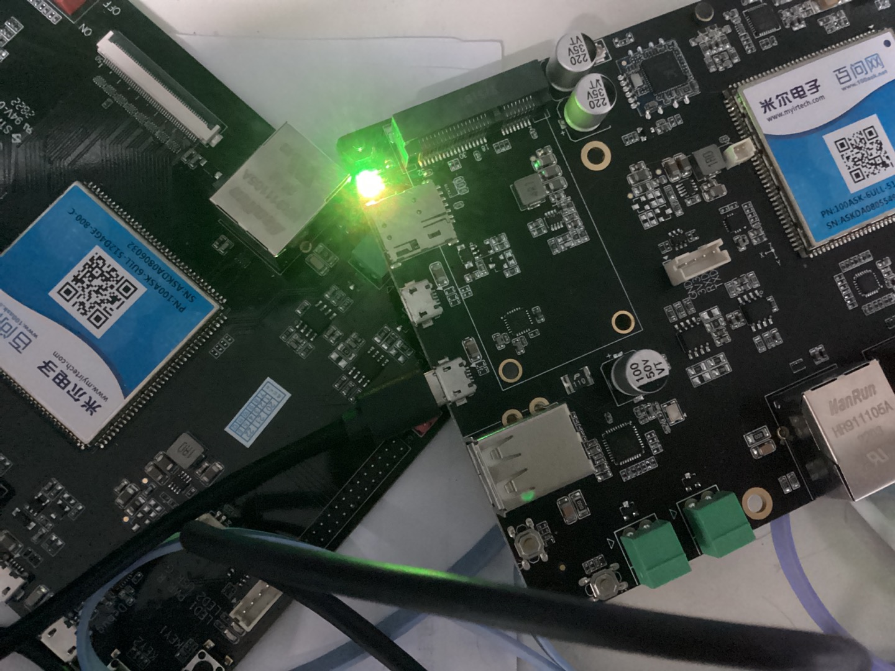
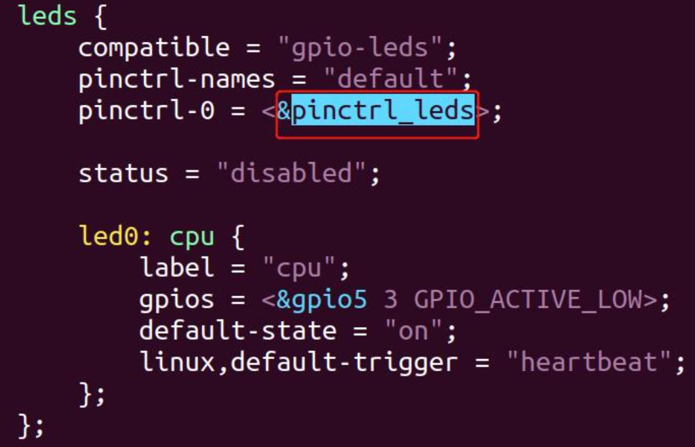
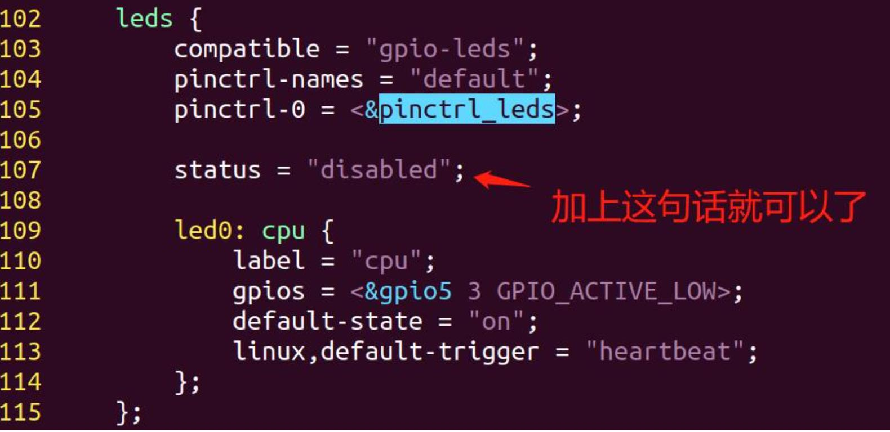

# led实验说明


## 1.硬件介绍

本节实验使用到 100ask_IMX6ULL-PRO 开发板上的 LED灯。


## 2.看原理图确定引脚

打开当前目录的`100ask_imx6ull_v1.1.pdf`，100ASK_IMX6ULL使用的LED原理图如下，可知引脚是GPIO5_3：


## 3.使用设备树工具

在设备树工具中，如下图操作：


把下面这段代码复制到设备树里

```
        BOARD_InitPinsSnvs: BOARD_InitPinsSnvsGrp {        
        /*!< Function assigned for the core: Cortex-A7[ca7] */
            fsl,pins = <
                MX6ULL_PAD_SNVS_TAMPER3__GPIO5_IO03        0x000110A0
            >;
        };
```


## 4.修改设备树

来的这个目录输入如下指令：

`~/100ask_imx6ull-sdk/Linux-4.9.88/arch/arm/boot/dts`

`vi 100ask_imx6ull-14x14.dts`

找到`&iomuxc_snvc`节点并放在`&iomuxc_snvc`节点下面，并自己修改名称：


然后回到 `/` **根节点**处添加如下信息：

```
    myled {
        compatible = "100ask,leddrv";
        pinctrl-names = "default";
        pinctrl-0 = <&myled_for_gpio_subsys>;
        led-gpios = <&gpio5 3 GPIO_ACTIVE_LOW>;
    };
```


## 5.编译设备树文件

在目录`~/100ask_imx6ull-sdk/Linux-4.9.88`下,使用命令`make dtbs`




## 6.替换开发板下的设备树

然后把生成的`arch/arm/boot/dts/100ask_imx6ull-14x14.dtb`文件复制到NFS

执行如下命令：

```
book@100ask:~/100ask_imx6ull-sdk/Linux-4.9.88$ cp arch/arm/boot/dts/100ask_imx6ull-14x14.dtb ~/nfs_rootfs/
```


在开发板上执行如下命令即可：

// **生成** **arch/arm/boot/dts/100ask_imx6ull-14x14.dtb**，请把它放到板子的/boot **目录**

```
[root@100ask:/mnt]# cp 100ask_imx6ull-14x14.dtb /boot
[root@100ask:/mnt]# reboot
```


## 7.确定设备树节点文件是否生成

```
ls /proc/device-tree
```


## 8.Makefile文件说明

源码文件夹路径：`IMX6ULL/01_led`

```
# 1. 使用不同的开发板内核时, 一定要修改KERN_DIR
# 2. KERN_DIR中的内核要事先配置、编译, 为了能编译内核, 要先设置下列环境变量:
# 2.1 ARCH,          比如: export ARCH=arm64
# 2.2 CROSS_COMPILE, 比如: export CROSS_COMPILE=aarch64-linux-gnu-
# 2.3 PATH,          比如: export PATH=$PATH:/home/book/100ask_roc-rk3399-pc/ToolChain-6.3.1/gcc-linaro-6.3.1-2017.05-x86_64_aarch64-linux-gnu/bin 
# 注意: 不同的开发板不同的编译器上述3个环境变量不一定相同,
#       请参考各开发板的高级用户使用手册

KERN_DIR = /home/book/100ask_imx6ull-sdk/Linux-4.9.88

all:
        make -C $(KERN_DIR) M=`pwd` modules 
        $(CROSS_COMPILE)gcc -o ledtest ledtest.c 

clean:
        make -C $(KERN_DIR) M=`pwd` modules clean
        rm -rf modules.order
        rm -f ledtest

# 参考内核源码drivers/char/ipmi/Makefile
# 要想把a.c, b.c编译成ab.ko, 可以这样指定:
# ab-y := a.o b.o
# obj-m += ab.o

obj-m += leddrv.o
```


## 9.编译命令说明

在实验目录下输入如下命令来编译驱动模块：


编译成功后，将生成的`leddrv.ko`和`ledtest` 拷贝到NFS，执行命令如下：

```c
cp ledtest *.ko ~/nfs_rootfs/
```

开发板挂载网络文件系统：

```
[root@100ask:~]# mount -t nfs -o nolock,vers=3 192.168.5.11:/home/book/nfs_rootfs /mnt
```


## 10.加载驱动程序

在开发板上，使用insmod命令加载`leddrv.ko`

```
insmod leddrv.ko
```

测试驱动程序：

```
./led_test /dev/100ask_led0 on
./led_test /dev/100ask_led0 off
```

实验现象，发现开发板上的绿色led点亮：




## 11.需要注意的问题

### 11.1 解决设备树引脚被占用

当设备树引脚被占用时，又可能会导致实验失败

设备树中引脚给占用解决的方法：

①搜索`MX6ULL_PAD_SNVS_TAMPER3__GPIO5_IO03`，若发现此引脚在其他地方也被占用


②再搜索`pinctrl_leds`，得到如下信息：



③解决办法：

如下图处加上**status = "disabled";** 这句话

