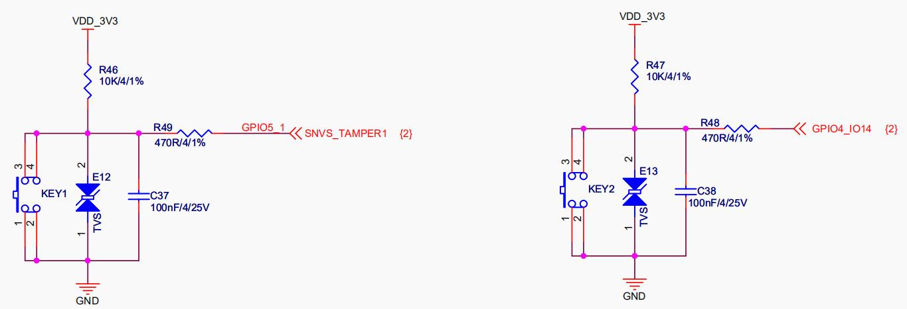
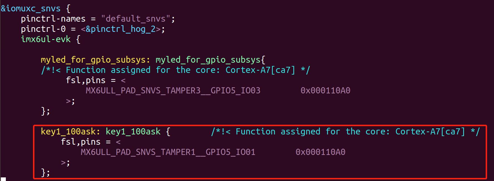
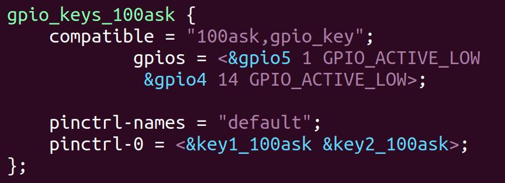

# key按键实验说明


## 1. 硬件介绍

本节实验使用到 100ask_IMX6ULL-PRO 开发板上的 KEY1、KEY2。


## 2.看原理图确定引脚

打开`100ask_imx6ull_v1.1.pdf`，100ASK_IMX6ULL使用的kEY1、KEY2原理图如下，可知引脚是`GPIO5_1`与`GPIO4_IO14`：




## 3.修改设备树文件

来到这个目录输入如下指令：

```
cd ~/100ask_imx6ull-sdk/Linux-4.9.88/arch/arm/boot/dts
vi 100ask_imx6ull-14x14.dts
```


在`iomuxc_snvs`子节点下添加如下信息：



在`iomuxc`子节点下添加如下信息：


在`/`根节点下添加如下信息：

```
    gpio_keys_100ask {
        compatible = "100ask,gpio_key";
                gpios = <&gpio5 1 GPIO_ACTIVE_LOW
                 &gpio4 14 GPIO_ACTIVE_LOW>;
    
        pinctrl-names = "default";
        pinctrl-0 = <&key1_100ask &key2_100ask>;
    };  
```




## 4.编译设备树

```
book@100ask:~/100ask_imx6ull-sdk/Linux-4.9.88$ make dtbs
book@100ask:~/100ask_imx6ull-sdk/Linux-4.9.88$ cp arch/arm/boot/dts/100ask_imx6ull-14x14.dtb ~/nfs_rootfs/
```

把设备树拷贝到开发板上运行：

```
[root@100ask:/mnt]# cp 100ask_imx6ull-14x14.dtb /boot
[root@100ask:/mnt]# reboot
```


## 5.查看生成的设备树节点信息

reboot 使用新的设备树重新启动之后正常情况下会在开发板的“/proc/device-tree”目录下生成“ gpio_keys_100ask”设备树节点。


## 6.Makefile说明

```makefile
# 1. 使用不同的开发板内核时, 一定要修改KERN_DIR
# 2. KERN_DIR中的内核要事先配置、编译, 为了能编译内核, 要先设置下列环境变量:
# 2.1 ARCH,          比如: export ARCH=arm64
# 2.2 CROSS_COMPILE, 比如: export CROSS_COMPILE=aarch64-linux-gnu-
# 2.3 PATH,          比如: export PATH=$PATH:/home/book/100ask_roc-rk3399-pc/ToolChain-6.3.1/gcc-linaro-6.3.1-2017.05-x86_64_aarch64-linux-gnu/bin 
# 注意: 不同的开发板不同的编译器上述3个环境变量不一定相同,
#       请参考各开发板的高级用户使用手册

KERN_DIR = # 板子所用内核源码的目录

all:
	make -C $(KERN_DIR) M=`pwd` modules 
	$(CROSS_COMPILE)gcc -o button_test button_test.c

clean:
	make -C $(KERN_DIR) M=`pwd` modules clean
	rm -rf modules.order

# 参考内核源码drivers/char/ipmi/Makefile
# 要想把a.c, b.c编译成ab.ko, 可以这样指定:
# ab-y := a.o b.o
# obj-m += ab.o

obj-m += gpio_key_drv.o
```

在Ubuntu下，执行编译命令


把生成的`gpio_key_drv.ko`和`button_test`拷贝到NFS网络文件系统


## 7.加载驱动模块并进行测试

加载命令：

```
[root@100ask:~]# insmod gpio_key_drv.ko
[root@100ask:/mnt]# ./button_test /dev/100ask_gpio_key
```


实验结果：


