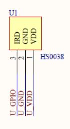

# IRDA红外遥控模块驱动实验

> 红外遥控简介
>
> 红外遥控被广泛应用于家用电器、工业控制和智能仪器系统中，像我们熟知的有电视机盒子遥控器、空调遥控器。红外遥控器系统分为发送端和接收端，如图下图所示。
>
> 
>
> 发送端就是红外遥控器，上面有许多按键，当我们按下遥控器按键时，遥控器内部电路会进行编码和调制，再通过红外发射头，将信号以肉眼不可见的红外线发射出去。红外线线虽然肉眼不可见，但可以通过手机摄像头看到，常用该方法检查遥控器是否正常工作。
>
> 接收端是一个红外接收头，收到红外信号后，内部电路会进行信号放大和解调，再将数据传给板子上的GPIO，板子收到数据后再解码才能确定是哪个按键被按下。


## 1.硬件介绍

模块原理图及资料：网盘开发板配套资料“05_Hardware (原理图)/Extend_modules/irda.zip”。


## 2.硬件与开发板连接方法

IMX6ULL先断电，按下图所示，将模块插在扩展板的GPIO0，将扩展板插在底板上。

**注意**：为了防止用户接错方向，模块和扩展板都有一条长白线，连接时需要模块上的白线和扩展板的白线在同一侧。

然后准备好配套的红外遥控器，如果是第一次使用红外遥控器，要先取出电池上的隔离薄膜。




## 3.修改设备树

在设备树的根节点下添加如下信息：

```
    hs0038 {
        compatible = "100ask,hs0038";
        gpios = <&gpio4 19 GPIO_ACTIVE_HIGH>;
    };
```


## 4.编译设备树

```
book@100ask:~/100ask_imx6ull-sdk/Linux-4.9.88$ make dtbs
book@100ask:~/100ask_imx6ull-sdk/Linux-4.9.88$ cp arch/arm/boot/dts/100ask_imx6ull-14x14.dtb ~/nfs_rootfs/
```


把设备树拷贝到开发板上运行：

```
[root@100ask:/mnt]# cp 100ask_imx6ull-14x14.dtb /boot
[root@100ask:/mnt]# reboot
```


## 5.查看生成的设备树节点信息

reboot 使用新的设备树重新启动之后正常情况下会在开发板的“/proc/device-tree”目录下生成"hs0038"设备树节点。


## 6.Makefile说明

```makefile
# 1. 使用不同的开发板内核时, 一定要修改KERN_DIR
# 2. KERN_DIR中的内核要事先配置、编译, 为了能编译内核, 要先设置下列环境变量:
# 2.1 ARCH,          比如: export ARCH=arm64
# 2.2 CROSS_COMPILE, 比如: export CROSS_COMPILE=aarch64-linux-gnu-
# 2.3 PATH,          比如: export PATH=$PATH:/home/book/100ask_roc-rk3399-pc/ToolChain-6.3.1/gcc-linaro-6.3.1-2017.05-x86_64_aarch64-linux-gnu/bin 
# 注意: 不同的开发板不同的编译器上述3个环境变量不一定相同,
#       请参考各开发板的高级用户使用手册

#KERN_DIR =  /home/book/100ask_stm32mp157_pro-sdk/Linux-5.4
KERN_DIR =  /home/book/100ask_imx6ull-sdk/Linux-4.9.88

all:
	make -C $(KERN_DIR) M=`pwd` modules 
	$(CROSS_COMPILE)gcc -o hs0038_test hs0038_test.c
clean:
	make -C $(KERN_DIR) M=`pwd` modules clean
	rm -rf modules.order  hs0038_test

# 参考内核源码drivers/char/ipmi/Makefile
# 要想把a.c, b.c编译成ab.ko, 可以这样指定:
# ab-y := a.o b.o
# obj-m += ab.o

obj-m += hs0038_drv.o
```

在Ubuntu下，执行编译命令`make`，并拷贝到开发板上运行：

```
cp hs0038_test *.ko ~/nfs_rootfs/
```


## 7.加载驱动模块并进行测试

```
[root@100ask:/mnt]# insmod hs0038_drv.ko
[root@100ask:/mnt]# ./hs0038_test /dev/myhs0038
```


