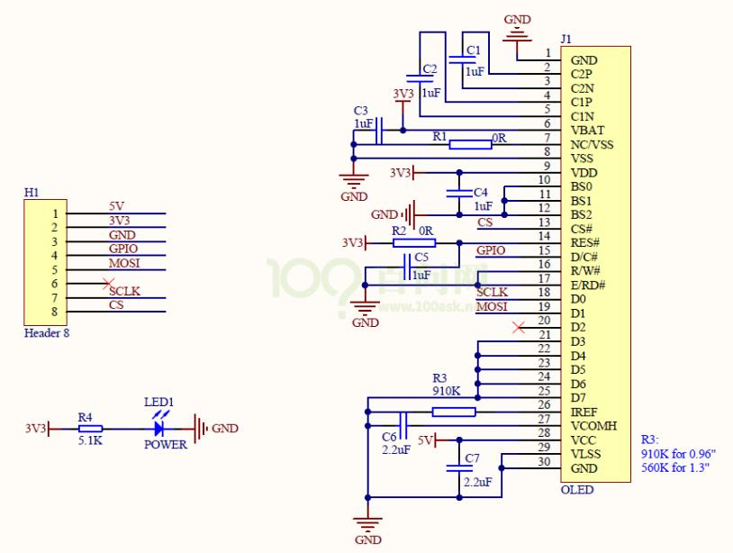

# oled模块驱动实验


## 1.硬件介绍

在这个实验中，我们使用百问网制作的OLED模块，该模块为0.96寸的屏幕，支持128*64像素显示。

该屏幕使用驱动芯片SSD1306。SSD1306是一块内置CMOS OLED/PLED驱动控制器的IC芯片，芯片可以驱动共阴型OLED面板。芯片内部包含晶振、显示RAM、对比度控制模块以及256级亮度控制模块，大大降低了外围元器件数量和功耗。

主机可以通过6800/8000并行接口、I2C接口或者SPI接口实现对SSD1306的控制，百问网的OLED模块是使用的SPI接口进行控制。原理图如下：




## 2.硬件与开发板连接方法

IMX6ULL先断电，按下图所示，将模块插在扩展板的SPI_A，将扩展板插在底板上。

注意：为了防止用户接错方向，模块和扩展板都有一条长白线，连接时需要模块上的白线和扩展板的白线在同一侧。


## 3.修改设备树


## 4.编译设备树


把设备树拷贝到开发板上运行：

```
[root@100ask:/mnt]# cp 100ask_imx6ull-14x14.dtb /boot
[root@100ask:/mnt]# reboot
```

reboot 使用新的设备树重新启动之后正常情况下会在开发板的“/proc/device-tree”目录下生成"oled"设备树节点。


## 5.Makefile说明

```makefile
# 1. 使用不同的开发板内核时, 一定要修改KERN_DIR
# 2. KERN_DIR中的内核要事先配置、编译, 为了能编译内核, 要先设置下列环境变量:
# 2.1 ARCH,          比如: export ARCH=arm64
# 2.2 CROSS_COMPILE, 比如: export CROSS_COMPILE=aarch64-linux-gnu-
# 2.3 PATH,          比如: export PATH=$PATH:/home/book/100ask_roc-rk3399-pc/ToolChain-6.3.1/gcc-linaro-6.3.1-2017.05-x86_64_aarch64-linux-gnu/bin 
# 注意: 不同的开发板不同的编译器上述3个环境变量不一定相同,
#       请参考各开发板的高级用户使用手册

#KERN_DIR =  /home/book/100ask_stm32mp157_pro-sdk/Linux-5.4
KERN_DIR =  /home/book/100ask_imx6ull-sdk/Linux-4.9.88

all:
	make -C $(KERN_DIR) M=`pwd` modules 
	$(CROSS_COMPILE)gcc -o oled_test oled_test.c
clean:
	make -C $(KERN_DIR) M=`pwd` modules clean
	rm -rf modules.order  oled_test

# 参考内核源码drivers/char/ipmi/Makefile
# 要想把a.c, b.c编译成ab.ko, 可以这样指定:
# ab-y := a.o b.o
# obj-m += ab.o

obj-m += oled_drv.o
```


## 6.加载驱动模块并进行测试

```
[root@100ask:/mnt]# insmod oled_drv.ko
[root@100ask:/mnt]# ./spi_oled /dev/myoled
```


## 7.实验结果


