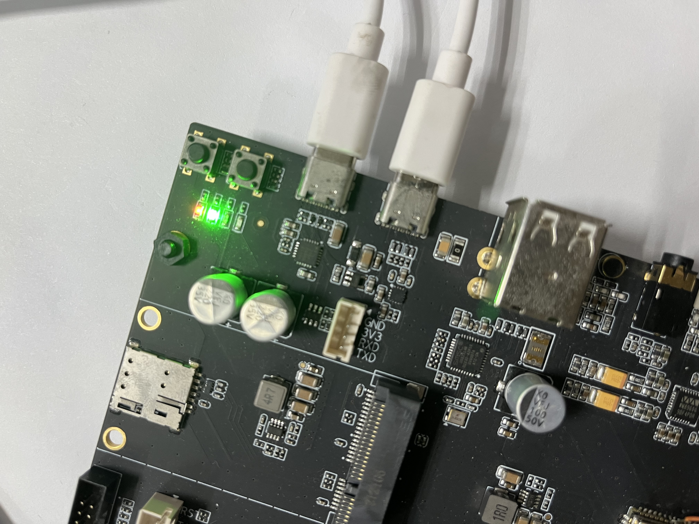

# STM32MP157的LED驱动程序

## 1.硬件介绍

本节实验使用到 100ask_IMX6ULL-PRO 开发板上的 LED灯。

## 2.看原理图确定引脚

打开当前目录的`100ASK_STM32MP157_PRO_V11_底板原理图.pdf`，`100ASK_STM32MP157_PRO使用的LED原理图如下，可知引脚有GPIOA_10和GPIOG_8，本实验采用GPIOA_10。


## 3.修改设备树

stm32mp157的设备树目录为：

`100ask_stm32mp157_pro-sdk/Linux-5.4/arch/arm/boot/dts/stm32mp157c-100ask-512d-lcd-v1.dts`

进入内核目录

```
cd ~/100ask_stm32mp157_pro-sdk/Linux-5.4
```

修改设备树dts

```
vi arch/arm/boot/dts/stm32mp157c-100ask-512d-lcd-v1.dts
```

增加如下内容，

```
        myled {
                compatible = "100ask,leddrv";
                pinctrl-names = "default";
                led-gpios = <&gpioa 10 GPIO_ACTIVE_LOW>;
        };
```

将文件夹中的100ask_led.dts设备树文件内容放入stm32mp157c-100ask-512d-lcd-v1.dts文件中，如下图所示，将内容添加到红色框内。

s

注意配置交叉编译工具链：

```
export ARCH=arm
export CROSS_COMPILE=arm-buildroot-linux-gnueabihf-
export PATH=$PATH:/home/book/100ask_stm32mp157_pro-sdk/ToolChain/arm-buildroot-linux-gnueabihf_sdk-buildroot/bin
```

编译设备树

```
make dtbs
```

将生成的stm32mp157c-100ask-512d-lcd-v1.dtb拷贝到nfs_rootfs目录中

```
cp arch/arm/boot/dts/stm32mp157c-100ask-512d-lcd-v1.dtb ~/nfs_rootfs/
```


## 4.编译LED程序

修改Makefile文件，将下图中Makefile文件中的KERN_DIR修改为开发板内核目录，如使用的是百问网提供的Ubuntu镜像目录设置为：

```
/home/book/100ask_stm32mp157_pro-sdk/Linux-5.4
```


输入make，编译程序。


将生成的驱动程序leddrv.ko和应用程序ledtest拷贝到网络文件系统中，输入

```
cp leddrv.ko ledtest ~/nfs_rootfs/
```


## 5.开发板上机实验

在保证开发板和Ubuntu可以ping通的情况下，将开发板挂载网络文件系统，输入：

```
 mount -t nfs -o nolock,vers=3 192.168.10.149:/home/book/nfs_rootfs /mnt
```

注意上面的192.168.10.149需要修改为自己的Ubuntu的ip，具体操作可参考嵌入式Linux应用开发完全手册第2篇的第七章。

查询开发板上保存内核和设备树的分区

```
cat /proc/mounts
```


执行挂载命令，输入

```
mount /dev/mmcblk2p2 /boot/
```

拷贝mnt目录下的设备树到boot目录，输入

```
cp /mnt/stm32mp157c-100ask-512d-lcd-v1.dtb /boot/
```

将mnt目录下的驱动程序和可执行程序拷贝出来

```
cp /mnt/leddrv.ko ~
cp /mnt/ledtest ~
```

重启开发板

```
reboot
```

重启完成后，开始安装驱动，输入

```
insmod leddrv.ko
```

测试驱动程序，输入

```
./ledtest /dev/100ask_led0 on
```

实验现象，可以看到绿色灯亮起：

