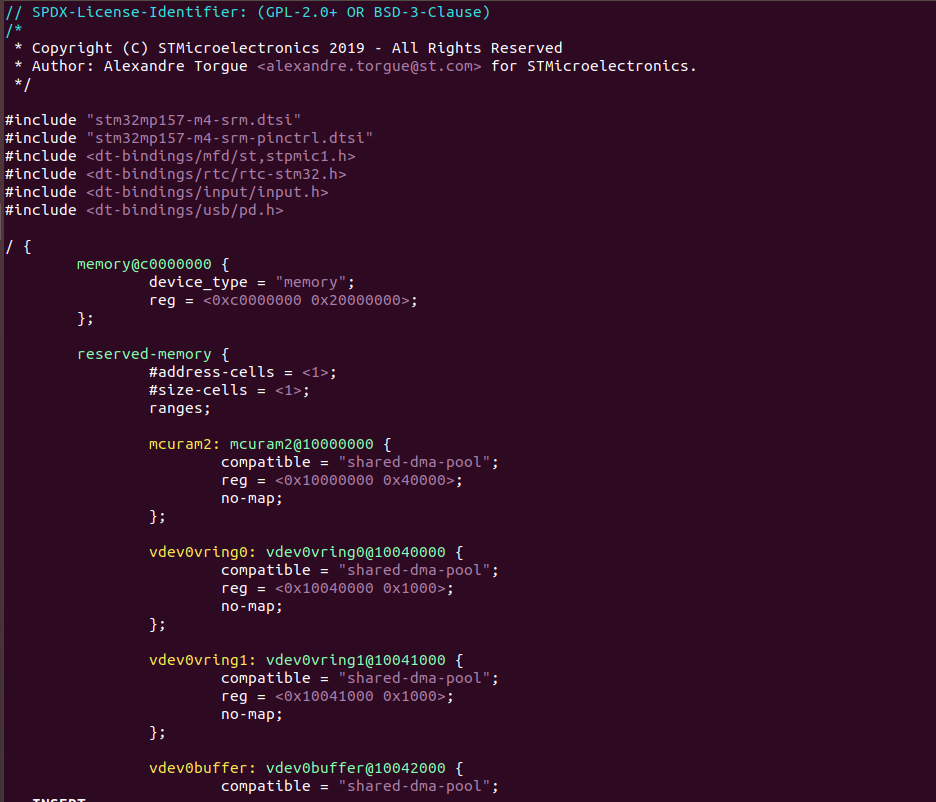
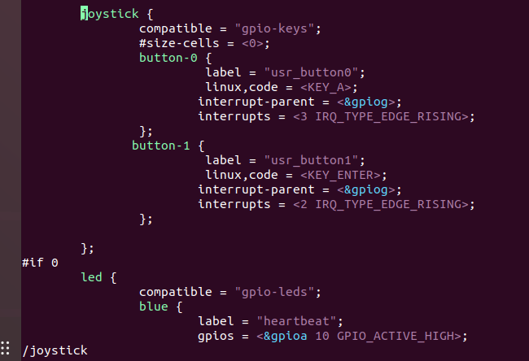
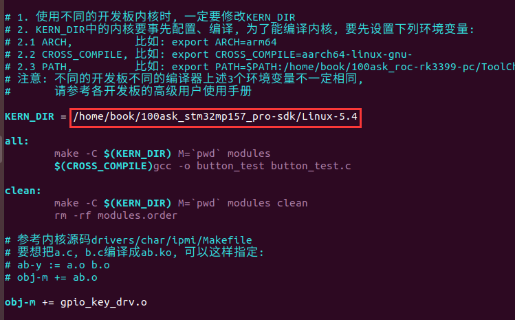

# key按键实验说明

## 1. 硬件介绍

本节实验使用到 100ask_STM32MP157-PRO 开发板上的 KEY1、KEY2。

## 2.看原理图确定引脚

打开`100ASK_STM32MP157_PRO_V11_底板原理图.pdf`，100ASK_STM32MP157_PRO使用的kEY1、KEY2原理图如下，可知引脚是`GPIOG_3`与`GPIOG_2`：


## 3.修改设备树

100ASK_STM32MP157_PRO的设备树目录为：	

`100ask_stm32mp157_pro-sdk/Linux-5.4/arch/arm/boot/dts/stm32mp157c-100ask-512d-lcd-v1.dts`

进入内核目录

```
cd ~/100ask_stm32mp157_pro-sdk/Linux-5.4
```

修改设备树dts

```
vi arch/arm/boot/dts/stm32mp157c-100ask-512d-lcd-v1.dts
```

增加如下内容，

```
        gpio_keys_100ask {
                compatible = "100ask,gpio_key";
                gpios = <&gpiog 3 GPIO_ACTIVE_LOW
                &gpiog 2 GPIO_ACTIVE_LOW>;
        };
```

将文件夹中的100ask_led.dts设备树文件内容放入stm32mp157c-100ask-512d-lcd-v1.dts文件中，如下图所示，将内容添加到红色框内。


把 原 来 的 GPIO 按 键 节 点 禁 止 掉 ： 修 改 arch/arm/boot/dts/stm32mp15xx-100ask.dtsi。输入

```
vi arch/arm/boot/dts/stm32mp15xx-100ask.dtsi
```

进入如下图目录：



输入/joystick，再按回车。即可到如下界面。



输入i进行编辑，如下图红框所示，增加如下内容

```
status = "disabled";
```


编译设备树

```
make dtbs
```

将生成的stm32mp157c-100ask-512d-lcd-v1.dtb拷贝到nfs_rootfs目录中

```
cp arch/arm/boot/dts/stm32mp157c-100ask-512d-lcd-v1.dtb ~/nfs_rootfs/
```


## 4.编译程序

修改Makefile文件，将下图中Makefile文件中的KERN_DIR修改为开发板内核目录，如使用的是百问网提供的Ubuntu镜像目录设置为：

```
/home/book/100ask_stm32mp157_pro-sdk/Linux-5.4
```



输入make，编译程序。


将生成的驱动程序leddrv.ko和应用程序ledtest拷贝到网络文件系统中，输入

```
 cp gpio_key_drv.ko button_test ~/nfs_rootfs/
```

## 5.开发板上机实验

在保证开发板和Ubuntu可以ping通的情况下，将开发板挂载网络文件系统，输入：

```
 mount -t nfs -o nolock,vers=3 192.168.5.11:/home/book/nfs_rootfs /mnt
```

注意上面的192.168.5.11需要修改为自己的Ubuntu的ip，具体操作可参考嵌入式Linux应用开发完全手册第2篇的第七章。

拷贝mnt目录下的设备树到boot目录，输入

```
cp /mnt/stm32mp157c-100ask-512d-lcd-v1.dtb /boot/
```

将mnt目录下的驱动程序和可执行程序拷贝出来

```
 cp /mnt/gpio_key_drv.ko ~
 cp /mnt/button_test ~
```

重启开发板

```
reboot
```

重启完成后，开始安装驱动，输入

```
insmod gpio_key_drv.ko
```

测试驱动程序，输入

```
./button_test /dev/100ask_gpio_key
```

实验现象，按下按键输入结果如下：

