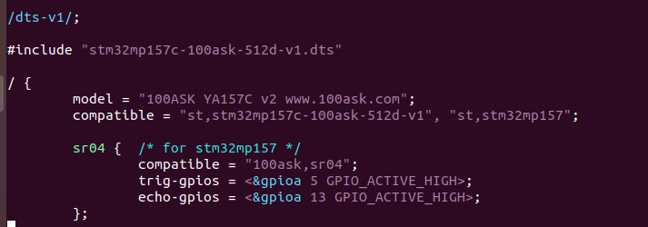
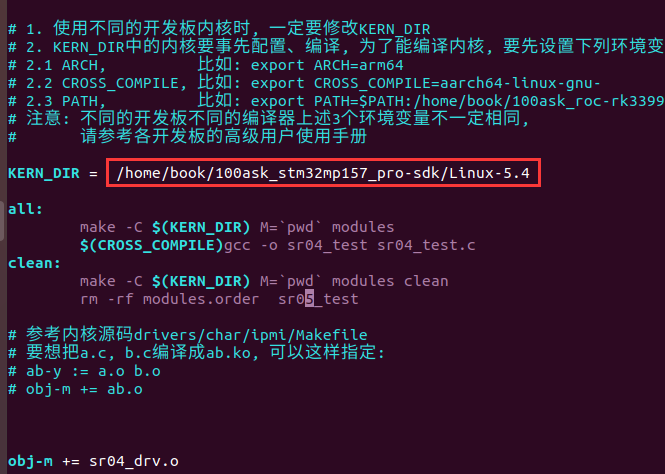

# sr04超声波传感器实验说明


## 1.硬件介绍

**模块原理图及资料**：`超声波.zip`。

## 2.硬件与开发板连接的方法

STM32MP157先断电，按下图所示，将模块插在扩展板的GPIO0，将扩展板插在底板上。

注意：为了防止用户接错方向，模块和扩展板都有一条长白线，连接时需要模块上的白线和扩展板的白线在同一侧。

注意：SR04模块中的如下图接线。


## 3.修改设备树

100ASK_STM32MP157_PRO的设备树目录为：	

`100ask_stm32mp157_pro-sdk/Linux-5.4/arch/arm/boot/dts/stm32mp157c-100ask-512d-lcd-v1.dts`

进入内核目录

```
cd ~/100ask_stm32mp157_pro-sdk/Linux-5.4
```

修改设备树dts

```
vi arch/arm/boot/dts/stm32mp157c-100ask-512d-lcd-v1.dts
```

增加如下内容，

```
        sr501 {
                compatible = "100ask,sr501";
                gpios = <&gpioa 5 GPIO_ACTIVE_HIGH>;
         };
```



修改sii902x设备树，按esc回到输入模式，输入/sii902x，回车查到到sii902x设备树，输入i进行修改，将sii902x@39的状态改为disabled


保存退出后编译设备树

```
make dtbs
```

将生成的stm32mp157c-100ask-512d-lcd-v1.dtb拷贝到nfs_rootfs目录中

```
cp arch/arm/boot/dts/stm32mp157c-100ask-512d-lcd-v1.dtb ~/nfs_rootfs/
```

## 4.编译程序

修改Makefile文件，将下图中Makefile文件中的KERN_DIR修改为开发板内核目录，如使用的是百问网提供的Ubuntu镜像目录设置为：

```
/home/book/100ask_stm32mp157_pro-sdk/Linux-5.4
```



输入make，编译程序。


将生成的驱动程序sr501_drv.ko和应用程序sr501_test拷贝到网络文件系统中，输入

```
cp sr04_drv.ko sr04_test ~/nfs_rootfs/
```


## 5.开发板上机实验

在保证开发板和Ubuntu可以ping通的情况下，将开发板挂载网络文件系统，输入：

```
 mount -t nfs -o nolock,vers=3 192.168.5.11:/home/book/nfs_rootfs /mnt
```

注意上面的192.168.5.11需要修改为自己的Ubuntu的ip，具体操作可参考嵌入式Linux应用开发完全手册第2篇的第七章。

拷贝mnt目录下的设备树到boot目录，输入

```
cp /mnt/stm32mp157c-100ask-512d-lcd-v1.dtb /boot/
```

将mnt目录下的驱动程序和可执行程序拷贝出来

```
cp /mnt/sr04_drv.ko ~
cp /mnt/sr04_test ~
```

重启开发板

```
reboot
```

重启完成后，开始安装驱动，输入

```
insmod sr501_drv.ko
```

测试程序：

```
./sr04_test /dev/sr04
```

实验现象：


