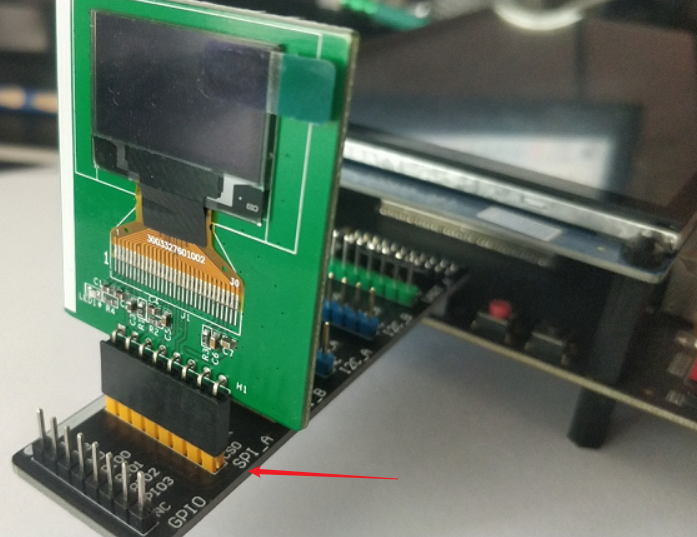
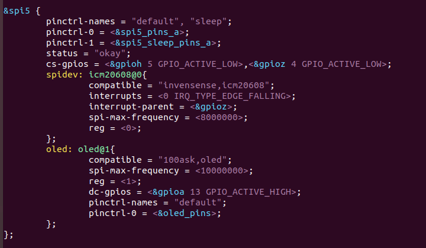
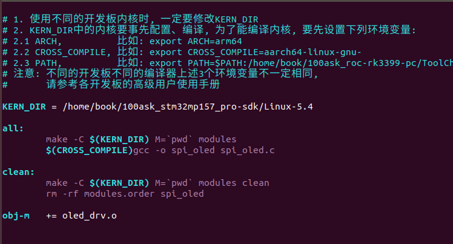
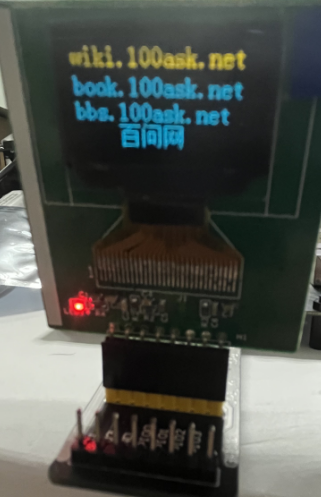

# OLED屏幕实验说明


## 1.硬件介绍

**模块原理图及资料**：`oled.zip`。

## 2.硬件与开发板连接的方法

STM32MP157先断电，按下图所示，将模块插在扩展板的GPIO0，将扩展板插在底板上。

注意：为了防止用户接错方向，模块和扩展板都有一条长白线，连接时需要模块上的白线和扩展板的白线在同一侧。

注意：oled模块中的如下图接线。



## 3.修改设备树

100ASK_STM32MP157_PRO的设备树目录为：	

`100ask_stm32mp157_pro-sdk/Linux-5.4/arch/arm/boot/dts/stm32mp157c-100ask-512d-lcd-v1.dts`

进入内核目录

```
cd ~/100ask_stm32mp157_pro-sdk/Linux-5.4
```

修改设备树dts

```
vi arch/arm/boot/dts/stm32mp157c-100ask-512d-lcd-v1.dts
```

找到spi5，修改为如下内容，

```
&spi5 {
        pinctrl-names = "default", "sleep";
        pinctrl-0 = <&spi5_pins_a>;
        pinctrl-1 = <&spi5_sleep_pins_a>;
        status = "okay";
        cs-gpios = <&gpioh 5 GPIO_ACTIVE_LOW>, <&gpioz 4 GPIO_ACTIVE_LOW>;
        spidev: icm20608@0{
                compatible = "invensense,icm20608";
                interrupts = <0 IRQ_TYPE_EDGE_FALLING>;
                interrupt-parent = <&gpioz>;
                spi-max-frequency = <8000000>;
                reg = <0>;
        };
        oled: oled@1{
                compatible = "100ask,oled";
                spi-max-frequency = <10000000>;
                reg = <1>;
                dc-gpios = <&gpioa 13 GPIO_ACTIVE_HIGH>;
                pinctrl-names = "default";
                pinctrl-0 = <&oled_pins>;
        };
};
```



还需要增加使用的引脚，修改`arch/arm/boot/dts/stm32mp157-100ask-pinctrl.dtsi`文件，输入

```
vim arch/arm/boot/dts/stm32mp157-100ask-pinctrl.dtsi
```

增加如下内容

```
        oled_pins: oled_pins {
                pins {
                        pinmux = <STM32_PINMUX('A', 13, GPIO)>;
                        bias-disable;
                        drive-push-pull;
                        slew-rate = <1>;
                };
        };
```


保存退出后编译设备树

```
make dtbs
```

将生成的stm32mp157c-100ask-512d-lcd-v1.dtb拷贝到nfs_rootfs目录中

```
cp arch/arm/boot/dts/stm32mp157c-100ask-512d-lcd-v1.dtb ~/nfs_rootfs/
```


## 4.编译程序

程序位于source文件夹中。

修改Makefile文件，将下图中Makefile文件中的KERN_DIR修改为开发板内核目录，如使用的是百问网提供的Ubuntu镜像目录设置为：

```
/home/book/100ask_stm32mp157_pro-sdk/Linux-5.4
```



输入make，编译程序。


将生成的驱动程序oled_drv.ko和应用程序spi_oled拷贝到网络文件系统中，输入

```
cp oled_drv.ko spi_oled ~/nfs_rootfs/
```


## 5.开发板上机实验

在保证开发板和Ubuntu可以ping通的情况下，将开发板挂载网络文件系统，输入：

```
 mount -t nfs -o nolock,vers=3 192.168.5.11:/home/book/nfs_rootfs /mnt
```

注意上面的192.168.5.11需要修改为自己的Ubuntu的ip，具体操作可参考嵌入式Linux应用开发完全手册第2篇的第七章。

拷贝mnt目录下的设备树到boot目录，输入

```
cp /mnt/stm32mp157c-100ask-512d-lcd-v1.dtb /boot/
```

将mnt目录下的驱动程序和可执行程序拷贝出来

```
cp /mnt/oled_drv.ko ~
cp /mnt/spi_oled ~
```

重启开发板

```
reboot
```

重启完成后，开始安装驱动，输入

```
insmod oled_drv.ko
```

测试程序：

```
./spi_oled  /dev/100ask_oled
```

使用红外遥控器，按下按键的实验现象：

